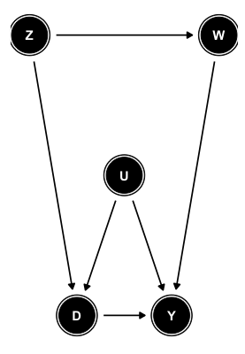

## ggdag

### Reference links:

1. https://ggdag.netlify.com/articles/intro-to-ggdag.html
2. https://ggdag.netlify.com/articles/intro-to-dags.html
3. https://ggdag.netlify.com/articles/bias-structures.html

### Basics:

```{r library, warning=FALSE, message=FALSE}
library(ggdag)
```

#### Directed edge
```{r fig.width = 5, fig.height = 4}
dagify(y ~ x) %>% 
  ggdag()
```

#### Bi-directed edge
```{r fig.width = 5, fig.height = 4}
dagify(y ~~ x) %>% 
  ggdag()
```

#### x is a confounder
```{r fig.width = 5, fig.height = 4}
dagify(y ~ x,
       d ~ x,
       y ~ d) %>% 
  ggdag() 
```

#### x is a mediator
```{r fig.width = 5, fig.height = 4}
dagify(y ~ x,
       x ~ d,
       y ~ d) %>% 
  ggdag() 
```

#### x is a collider
```{r fig.width = 5, fig.height = 4}
dagify(x ~ y,
       x ~ d,
       y ~ d) %>% 
  ggdag()
```

#### How to replicate DAGs

For this week's assignment you will be tasked to render a DAG with `ggdag`. For this task, you may want to explore how to convey coordinates. Here in the lab we will see how to replicate this DAG:<br>
<center></center>

**The first step is to define the relationships between the variables**.

It can be done in two ways. We can input every directed tie, or input all ties that go to one variable, for example:

```{r}
#single tie approach
dag1 <- dagify(D ~ U,
               D ~ Z,
               W ~ Z, 
               Y ~ D, 
               Y ~ U,
               Y ~ W)

#all tie approach
dag2 <- dagify(D ~ U + Z,
              W ~ Z, 
              Y ~ D + U + W)
```

**Now we can plot our DAG.**
```{r}
ggdag(dag2)
```
<br>
**As we can see, the plot will have the correct ties; however, we still need to formulate the coordinates so that we can fully replicate our DAG. I suggest you do it like this**

I set the variable that is at the top left at the (0,0) point, then I move positively on the x-axis and negatively on the y-axis having the (0,0) variable as a point of reference. You can find alternative ways of conveying the coordinates, my way is just a suggestion.

```{r}
## create a list containing the x- and y-axis coordinates for each variable
coor <- list(
  x = c(Z = 0, D = 1, U = 2, Y = 3, W = 4),
  y = c(Z = 0, D = -2, U = -1, Y = -2, W = 0)
)

#all tie approach and setting coords equals to the list I created
dag <- dagify(D ~ U + Z,
              W ~ Z, 
              Y ~ D + U + W, coords = coor)

#plot
ggdag(dag)
```

