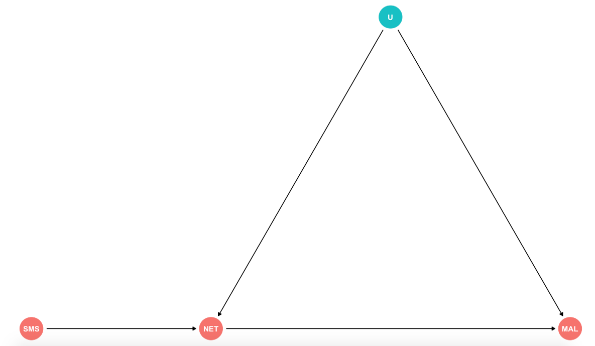
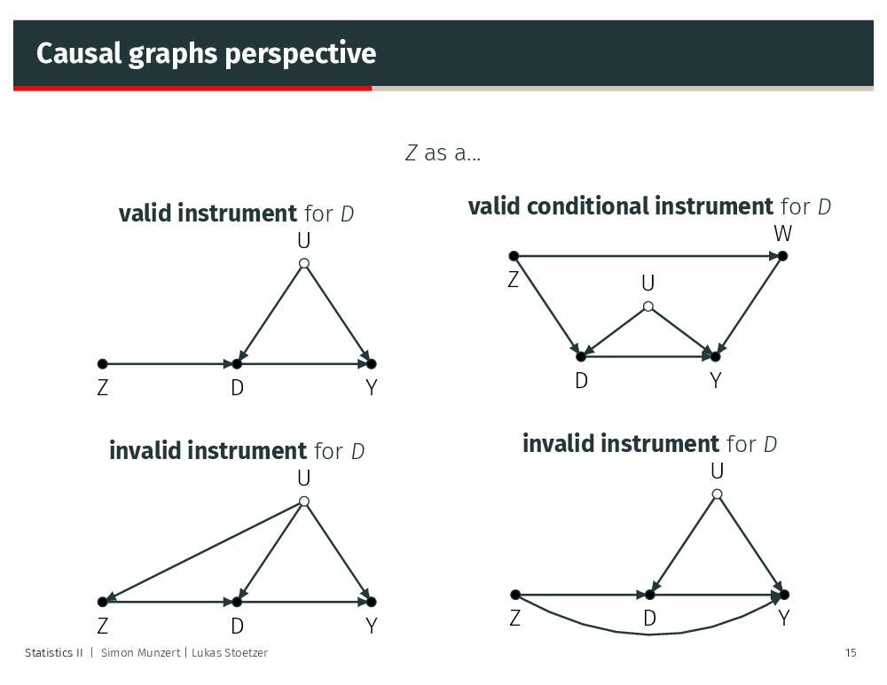

## Measuring the effect of mosquito net use on malaria infection

Imagine that the organization you work for is laying out a project to distribute mosquito nets to help combat malaria transmitions. You are in charge to run the impact evaluation of this program. You realize that it is unethical to randomize who receives the nets, so you consider an encouragement design. You decide to select five villages to send SMS reminders every night encouraging them to use the mosquito nets. (This example is using simulated data)



For this evaluation to render credible results we need to fulfill a certain set of assumtions:

**a) Relevance:** Also known as non-zero average encouragement effect. Does our $Z$ create variation in our $D$? In other words, is the mosquito net use different under the encouragement group? (Statistically testable)

**b) Exogeneity/Ignorability of the instrument:** Potential outcomes and treatments are independent of $Z$. In this case given by out randomization of encouragement by villages.

**c) Exclusion restriction:** The instrument only affects the outcome via the treatment. In other words, there are no alternative paths through which our SMS can have an effect on malaria infections other that the use of the mosquito nets.

**d) Monotonicity:** No defiers. We assume that non-compliers fall in the camp of always- and never-takers.

```{r warning=FALSE, message=FALSE}

library(dplyr) # for data wrangling
library(ggplot2) # for creating plots
library(summarytools) # for ctable()
library(stargazer) # for formatting model output
library(kableExtra) # for formatting data frames
library(AER) # for ivreg()

set.seed(123) # for consistent results

eval_data <- read.csv("./data/evaluation_data.csv") #loading simulated data frame of the intervention

```


### Exploring our results
You receive the results of your intervention from the M&E officers. This is what they look like:

```{r results ='asis', echo = FALSE}
st_options(footnote = NA) #to get rid of the footnote of ctable
print(ctable(eval_data$net_use, eval_data$sms, prop = "n"), method = "render")
```

<center>**LET'S EXPLORE COMPLIANCE TYPES FROM THIS TABLE TOGETHER**</center><br>

a) Where are our compliers and non-compliers?
b) How many people were encouraged via SMS, but did not use the net?
c) How many people were not encouraged via SMS, yet they utilized the net?

<br>
<br>

Additionally, we can explore visually our data to check beyond compliance and see in which groups malaria was present. In this case, we are dealing with binary outcomes. That is you can either be or not be infected, which are represented by the color dimension in different groups.


```{r echo = FALSE, fig.align="center"}
ggplot(eval_data, aes(x = factor(sms), y = factor(net_use), color = factor(malaria))) +
  geom_point() +
  geom_jitter() +
  theme_minimal() +
  scale_x_discrete(labels = c("SMS = 0", "SMS = 1")) +
  scale_y_discrete(labels = c("NET = 0", "NET = 1")) +
  scale_color_discrete(labels = c("Not infected", "Infected")) +
  labs(x = "Encouragement",
       y = "Treatment",
       color = "")
```

## Exploring our set-up

**- Let's check whether SMS encouragement is a strong instrument.** <p>
In other words, we are looking at the relevance assumption. Does our SMS encouragement create changes in our mosquito net use?

```{r}
summary(lm(net_use ~ sms, eval_data))
```
Economists have established as a "rule-of-thumb" for the case of a single endogenous regressor to be considered a strong instrument should have a **F-statistic** greater than 10. From this regression, we can see that SMS encouragement is a strong instrument. Additionally, the substantive read in this case is that only 33% of those who did not receive the SMS utilized the mosquito nets, where as 78% of those who got the SMS encouragement did. 
<p><p>
**- Let's gather a naïve estimate of mosquito net use and malaria infection.** <p>
Also why do you think we call this a naïve estimate?

```{r}
naive_model <- lm(malaria ~ net_use, eval_data)
summary(naive_model)
```
<p><p>
**- Let's gather our intent-to-treat effect (ITT).** <p>
This is the effect that our SMS encouragement had on malaria infections. $ITT = E(Malaria_i|SMS=1) - E(Malaria_i|SMS=0)$. What does this tell us?

```{r}
itt_model <- lm(malaria ~ sms, eval_data)
summary(itt_model)
```
<p><p>
**- Let's gather out local average treatment effect (LATE).**<p>
For this we can calculate the wald estimator as we defined $LATE = \frac{con(Y_i,Z_i)}{cov(D_i,Z_i)}$. You can do this with the sample code that Professors Munzert and Stoetzer utilized in their sessions. You can also gather the LATE through two-stage least squares (2SLS). We will learn how to do this with ivreg()<p>
ivreg() is part of the `AER` package. It fits instrumental-variable regression through two-stage least squares. The syntax is the following:

<center>ivreg(outcome ~ treatment | instrument)</center>
 <p>

```{r}
late_model <- ivreg(malaria ~ net_use | sms, data= eval_data)
summary(late_model)
```
<p><center>What is the substantive reading of these results?</center> 

## Thinking about the validity of instruments


<p>
We can also adapt the ivreg() syntax to accomodate valid conditional instruments:

<center>ivreg(Y ~ D + W | Z + W)</center>

<p><p>

## Weak instruments

We will turn the instrument from the lecture into a weak instrument.

```{r}
### THIS IS THE SIMULATION FROM THE LECTURE

# generate xStar and c and using a common variance
xStarAndC <- MASS::mvrnorm(1000, c(20, 15), matrix(c(1, 0.5, 0.5, 1), 2, 2))
xStar <- xStarAndC[, 1]
c <- xStarAndC[, 2]

# z is truly exogenous; x a combination of xStar and z
z <- rnorm(1000)
x <- xStar + z

# generate the response variable y
y <- 1 + x + c + rnorm(1000, 0, 0.5)

```
<br>
**Can we draw a DAG based on this simulation?**<p>

We have a portion of our $X$, that is $X*$, which has a common variance with $C$. We also have our instrument $Z$ that has a random normal distribution and is defining the rest of $X$. Finally, we have our outcome $Y$ which is a function of $X$, $C$, and some external factors.

Let's see if we have a strong or weak instrument:

```{r}
summary(lm(x~z))
```

We can see that we have a very strong instrument. The way we defined the simulation a unit increase in $Z$ is reflected directly in $X$. If we look at the formula $X = XStar + Z$. We can make this instrument weaker by reducing how much of $X$ is dependent on $Z$. For example:

```{r}
x <- xStar + 0.08*z
summary(lm(x~z))
```


**For the third task you will have to adapt the simulation code provided in the lecture to create a flawed/invalid instrument because it is connected to the outcome through another variable other than the treatment**

