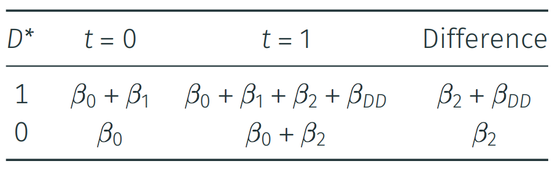

<br>

# 1. Difference-in-Differences
<br>

## 1.1 Measuring the effect of a soda tax on sugar-added drink consumption

After the very succesful impact evaluations you have performed in the past weeks, you are contacted by the local government of Pawnee, Indiana. The city is interested in your advice to assess a policy intervention passed with the support of councilwoman Leslie Knope. 

The city of Pawnee has been at the spotlight recently, as it has come to be known as the child obesity and diabetes capital of the state of Indiana. Some of the constituents of the city point at the fast food culture and soda sizes across the restaurants in town as a source of the problem. The largest food chain in Pawnee, Paunch Burger, offers its smallest soda size at a whopping 64oz (about 1.9 liters). 

The "soda tax", as it came to be known, came to effect initially at a couple of districts. Fortunately for you, based on an archaic law, residents of Indiana have to demonstrate their residence in the district they intend to dine before being served at any of the restaurants. The latter fact means that Pawnee inhabitants can only buy sugar-added drinks in their respective home district. 

<center>
</center>
<br>
<br>
<br>

## 1.2 Exploring the data

```{r warning=FALSE, message=FALSE}

set.seed(42) #for consistent results

library(dplyr) # to wrangle our data
library(tidyr) # to wrangle our data - gather()
library(ggplot2) # to render our graphs
library(haven) # to load our .dta files for the assignment
library(plm) # to run our fixed effects models
library(kableExtra) # to render better formatted tables
library(stargazer) # for formatting your model output

soda_tax_df <- read.csv("./data/soda_tax_df.csv") # simulated data

names(soda_tax_df) # to check the names of the variables in our data
```

<br>
Our dataset *soda_tax_df*, contains the following information:

+ `ìd`: A unique number identifier for each of the 7,500 inhabitants of Pawnee
+ `district`: The name of the district in which the corresponding unit lives
+ `treatment`: A binary variable that signals whether the subject lived in a district where the tax was implemented
+ `pre_tax`: The weekly sugar-added drink consumption in ounces before the tax was imposed
+ `post_tax`: The weekly sugar-added drink consuption in ounces after the tax was imposed
+ `change`: The difference in sugar-added drink consuption between post- and pre-tax

<br>

#### Let's check how many units are there in every district and which districts have treated units

We can use the base R *table()* function, which performs categorical tabulation of data with the variable and its frequency, to check how many people live on each district. 

```{r}
table(soda_tax_df$district) %>% 
  kable() %>% # create kable table
  kable_styling() # view kable table
```

<p>
Even more, we can create a two-way cross-table to check how many treated units live in each district.
<p>

```{r}
table(soda_tax_df$treatment, soda_tax_df$district) %>% 
  kable() %>% # create kable table
  kable_styling() # view kable table
```

<br>

 
#### Let's check the distribution of sugar-added drinks consumption at different points in time
<p>
We can also utilize *summary()* to check the distribution of our variables. In this case, we can look at the distribution of our variable of interest at the two points in time:
<p>
<center>**Pre-tax consumption levels**</center>

```{r}
summary(soda_tax_df$pre_tax)
```
<p>
<center>**Post-tax consumption levels**</center>

```{r}
summary(soda_tax_df$post_tax)
```

<br>
<br>
<br>
<br>

## 1.3 Modeling and estimating

So far we have ignored time in our estimations. Up until this point, most of the tools we have learnt produce estimates of the counterfactual through explicit assignment rules that work random or as-if-random (e.g. randomized experimental, regression discountinuity, and instrumental set-ups). 

Difference-in-differences compares the changes in outcomes over time between units under different treatment states. This allows us to correct for any differences between the treatment and comparison groups that are constant over time assuming that the trends in time are parallel.
<br>
<br>

### a. Calculating without time

If we did not have the `pre_tax` baseline measure, we would likely utilize the `post_tax` to explore the average effect on the treated. In this case, we would model this as:
<p>

```{r}
after_model <- lm(post_tax ~ treatment, data = soda_tax_df)
```

<div align="center">
```{r results="asis"}
stargazer(after_model, type = "html")
```
</div>
<p>
<p>
We could read this result substantively as: those who lived in districts were the tax was implemented consumed on average 146.9 ounces less of sugar-added drinks per week compared to those who lived in districts were the tax was not put in place. **This calculation would give us a comparison of the treatment and control groups after treatment.** 

To believe the results of our `after_model`, we would need to believe that the mean ignorability of treatment assignment assumption is fulfilled. We would have to think carefully about possible factors that could differentiate our treatment and control groups. We use a treatment indicator based on the districts where the measure was able to be implemented. Treatment was not fully randomly assigned, so there may be lots of potential confounders that create baseline differences in the scores for those living in Old Eagleton compared to those in Snake Lounge, which also affect the after-treatment comparisons.

<br>
<br>

### b. Including the time dimension

We can introduce the time component to our calculation by incorporating the pre-treatment levels of sugar-added drink consumption, which gives us the diff-in-diff estimand. We could calculate this in a fairly straightforward manner:

```{r}
did_model <- lm(change ~ treatment, data = soda_tax_df)
```

<div align="center">
```{r results="asis"}
stargazer(did_model, type = "html")
```
</div>
<p>
<p>
We could read this result substantively as: those who lived in districts were the tax was implemented consumed on average 149.7 ounces less of sugar-added drinks per week compared to those who lived in districts were the tax was not put in place. **This calculation would give us the change, or difference, in sugar-added drink consumption for treatment and control groups.** 

To believe the results of our `did_model`, we would need to believe that there are parallel trends between the two groups.

<br>
*Note: when simulating the data the `post_tax` was defined as:* $post_tax = 15 + pre\_tax  - 150(treatment) + error$

<br>
<br>
<br>

### c. Looking under the hood

Remember the formula from the lecture where we estimate the diff-in-diff effect with time and treatment dummies? We can re-format our data to gather our diff-in-diff estimand<p>

$$Y_{it} = β_0 + β_1D^*_i + β_2P_t + β_{DD}D^∗_i × P_t + q_{it} $$
<p>
<p>
<center>where $D^*_i$ tell us if subject $i$ is in the treatment group and $P_t$
indicates the point in time (1 for post)</center>
<p>
We need to convert our data to a long format to render the time and treatment dummy variables. This is how our data looks like:<p>

```{r}
head(soda_tax_df, 6)
```
<p>
We will utilize the *pivot_longer()* function from `tidyr` to format our data frame.
<p>

```{r}
soda_tax_df_long <- soda_tax_df %>%
  select(id, pre_tax, post_tax, treatment) %>% # select the columns we are interested in
  pivot_longer(cols = c(pre_tax, post_tax), names_to = "period", values_to = "soda_drank") %>% # grab columns, put names to new variable period and values to new variable soda_drank
  mutate(after_tax = if_else(period == "post_tax", 1, 0)) # create dummy for period

head(soda_tax_df_long, 6)
```
<p> 
We can see that under our long format, we have two entries for every individual. We have our variable `after_tax`, which represents $P_t$, where 0 and 1 are pre- and post-tax periods respectively. We can now render our regression based on the formula: 

$$Y_{it} = β_0 + β_1D^*_i + β_2P_t + β_{DD}D^∗_i × P_t + q_{it}$$
<p>
```{r}
did_long <- lm(soda_drank ~ treatment + after_tax + treatment * after_tax, data = soda_tax_df_long)
```
<p>
We can think about the results of this regression in terms of this table, where $\beta{DD}$ is the difference in differences in group means:<p>
<p>
<center>
</center>
<br>
<div align="center">
```{r results="asis"}
stargazer(did_long, type = "html")
```
</div>
<p>
<p>
**If we go back to look our `did_model`, we can notice that by regressing the results we got at that stage were our $\beta_2$ and $\beta{DD}$.**
<br>
<br>
<br>

## 1.4 Drafting some brief recommedations

Based on your analysis of the data at hand, you decide to recommend that the tax measure should move forward in the rest of Pawnee. You state that it is a very good example of a pigouvian tax, which captures the negative externalities not included in the market price of sugar-added drinks. The findings suggest that the tax reduced the weekly sugar-added drink consumption by about 150 luquid ounces (almost 4.5 liters).
<p>
<p>
Your evaluation report is so convincing that the Director of the Parks Department, Ron Swanson, is even doubting libertarianism.
<p>
<p>
<center>
</center>
<br>
<br>
<br>
<br>
<br>

# 2. Fixed-Effects
<br>

## 2.1 Measuring the effect of a carbon tax on national carbon dioxide emissions per capita
<br>
You are hired as an outside consultant by the Organization of Economic Non-Cooperation for Development (OENCD), they are interested in studying the effect of a carbon tax on national carbon dioxide emissions per capita. You are provided with data for the twenty-members of the organization from 2009 to 2019. *The data can be called a true-panel based on the description given in the lecture*

<p>
<center>
</center>

<br>
<br>

## 2.2 Exploring the data

```{r warning=FALSE, message=FALSE}

carbon_tax_df <- read.csv("./data/carbon_tax_df.csv") # simulated data
names(carbon_tax_df) # to check the names of the variables in our data

```

<br>
Our dataset *carbon_tax_df*, contains the following information:

+ `country_name`: Name of the country
+ `country_code`: Three-letter country code
+ `year`: Year
+ `tax`: Dummy for whether the carbon tax was in place
+ `income_class`: Categorical variable with income label (Low to High)
+ `co2_per_capita`: carbon dioxide emissions per capita in metric tons (T)

<br>

#### Let's explore who had the tax in place at what point
<p>
We can use what we have learnt about the base R *table()* function, to check how many countries had a `tax` in place every year.

```{r}
table(carbon_tax_df$tax, carbon_tax_df$year) %>% 
  kable() %>% # create kable table
  kable_styling() # view kable table
```

<br>
<br>

#### Let's explore visually the levels of carbon dioxide emmissions
<p>

```{r fig.align="center"}
ggplot(carbon_tax_df, aes(x = year,
                          y= co2_per_capita, 
                          color = factor(tax))) +
  geom_point() + #create scatterplot
  theme_minimal() + 
  theme(legend.position="bottom") + #move legend to the bottom
  labs(title = "Exploratory plot of CO2 emissions per capita",
       x = "Year",
       y = "CO2 emissions in metric tons (T)",
       color = "Carbon tax") +
  scale_colour_discrete(labels = c("No", "In place")) #change labels of the legend

```
<p>
<p>
<center>**WHAT DO WE SEE HERE?**</center>
<p>
<p>
*Note: The exaploratoring our data portions of this lab script will not be directly applicable to this week's assignment. Still, exploratory data analysis will be very useful for the extension portion of your final replication paper. Summarizing, graphing, and exploring your data will be critical to discover patterns, to spot anomalies, and to check assumptions*
<br>
<br>
<br>
<br>

## 2.3 Modeling and estimating

We have seen during the lecture that true panel data can help us decompose the error term. With a true-panel we can capture all unobserved, unit- and time-specific factors. 
<p>
In the example at hand, we can think of unit-specific factors as characteristics of individual countries that are constant over time (e.g. a country that just loves big pick-up trucks). We can also think about time-specific factors that affect all countries (e.g. global economic shocks).
<p>
We can formulate this as:<p>
$$Y_{it} = β_0 + β_1D_it + \nu_{i} + θ_t + η_{it}$$
where $\nu_i$ reflects the time-invariant traits of the units $\theta_t$ reflects the time-specific factors that affect everyone  and $\eta_{it}$ is the **idiosyncratic error**
<br>
We will move forward by creating three models:<p>
+ A **naive model**, where we will regress `co2_per_capita` on `tax`.
+ A **model with unit-fixed effects**, where we will capture the $\theta$ portion of our error
+ A **model with time- and unit-fixed effects**, where we will capture our $\nu$ and $\theta$ portions of our error term

<br>
<br>
<br>
<br>

### 2.3.1 Naive modeling

```{r}
naive_carbon <- lm(co2_per_capita ~ tax, data = carbon_tax_df)
```

<br>
<div align="center">
```{r results="asis"}
stargazer(naive_carbon, type = "html")
```
</div>
<p>
<p>
This model is telling us that on average, the $CO_2$ emmissions per capita are reduced by 6.2 metric tons when a carbon tax is put in place. Still, after all the work we have done throughout the semester, we understand that there may be a plethora of factors that could be skewing the results of this bivarate regression.

<br>
<br>
<br>

### 2.3.2 Unit-fixed effects

We will learn two ways of gathering unit- and time-fixed effects in R. First, we will perform **Least Squares Dummy Variables (LSDV) estimation** with *lm()*, where we essentially get an individual estimate for each unit. Second, we will run our model with *plm()*, which will do the same mechanics, yet it will not render each of the units intercept.


```{r}
lsdv_unit_fe <- lm(co2_per_capita ~ tax + country_name, data = carbon_tax_df)
unit_fe <- plm(co2_per_capita ~ tax, data = carbon_tax_df, index = c("country_name"), model = "within")
```
<br>

#### Unit-fixed effects with lm() --- Least Squares Dummy Variables (LSDV) estimation

<div align="center">
```{r results="asis"}
stargazer(lsdv_unit_fe, type = "html")
```
</div><br>

#### Unit-fixed effects with plm()

<div align="center">
```{r results="asis"}
stargazer(unit_fe, type = "html")
```
</div>
<br>
**WHAT DO THESE RESULTS TELL US?** <p>

Adding unit-level fixed effects to the model, i.e. accounting for unobserved, time-invariant characteristics of countries and only focusing on within-state variation, an increase the imposition of a carbon tax reduces $CO_2$ per capita emissions by **4.44 metric tons**. Once we have captured the variation amongst countries, we can see that our results from the naive model were substantially biased. We can still try to capture the time-specific portion of the error.
<br>

*The results from the Least Squares Dummy Variables (LSDV) estimation are read in reference to a baseline. In this case, the constant is representing the intercept for Adjikistan. We can utilize the individual slopes for each country to say that Freedonians emit on average 5.93 more metric tons of $CO_2$ per capita than Adjikistanians.*

<br>
<br>
<br>


### 2.3.3 Unit- and time-fixed effects

We will perform our regressions with **Least Squares Dummy Variables (LSDV) estimation** with *lm()* and our simplified way with *plm()*.


```{r}
lsdv_unit_time_fe <- lm(co2_per_capita ~ tax + country_name + factor(year), data = carbon_tax_df)
unit_time_fe <- plm(co2_per_capita ~ tax, data = carbon_tax_df, index = c("country_name", "year"),  model = "within", effect = "twoways")
```
<br>

#### Unit- and time-fixed effects with lm() --- Least Squares Dummy Variables (LSDV) estimation

<div align="center">
```{r results="asis"}
stargazer(lsdv_unit_time_fe, type = "html")
```
</div><br>

#### Unit-fixed effects with plm()

<div align="center">
```{r results="asis"}
stargazer(unit_time_fe, type = "html")
```
</div>

<br>
**WHAT DO THESE RESULTS TELL US?** <p>
Now in addition to adding unit-level fixed effects to the model, we control for time-specific factors that affect the global per capita $CO_2$ emissions. The results suggest that the effect of a carbon-tax leads to a decrease $CO_2$ emissions of 3.91 metric tons per capita.

<br>
<br>
<br>

## 2.4 Drafting some brief recommedations

You report back to the Organization of Economic Non-Cooperation for Development (OENCD). Based on your analysis of the data at hand, you suggest that the implementation of a carbon tax does have an effect on national carbon dioxide emissions per capita. Your results show that a carbon tax reduces $CO_2$ emissions by 3.91 metric tons per capita. <p>

Your results are welcomed binternationally and all states move forward with the measure.
<br>

<center>
</center>


